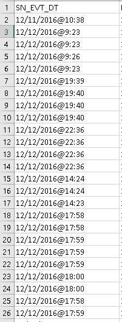
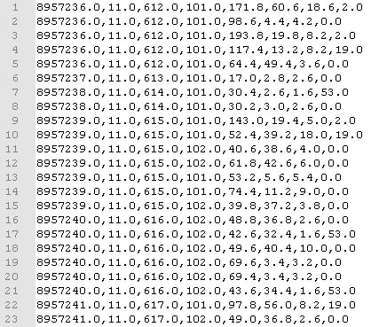
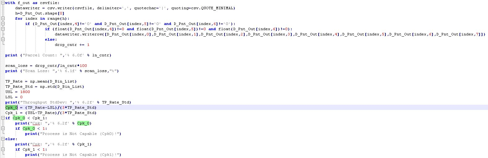

"# Python-Process-Capability-Index" 

Python script used to open, parse, and analyze a database contained within a sample CSV file. 

   [1] The CSV timestamp data is converted over into universal time.
   

   [2] The universal time is used to calculate process deltas. 

   
   [3] The deltas are used to calculate to calculate average and variance.
   
   [4] USL & LSL process limtis are hardcoded in the script, but can be calculated if needed.
   
   [5] The Cpk (Process Capability Index) is then calcualted with results printed for the user.

      
   [6] As a bonus, some other priority data is captured and stored within matrices for subsequent analysis.
         In this case the data is used to construct a histogram of object dimensions for Len, Wid, & Height.
      
   
Process Capability Index is a key metric in Sig Sigma used to understand whether or not a processs 
is capable or not. With a Cpk higher than 0.8 it is commonly accepted that the process is becoming 
capable. When Cpk is higher than 1 the process is capable. The ultimate interpretation of the index 
value is up to the discretion of the user and process owners, but comparison of several concurrent and 
interdependent processes can easily be analyzed and prioritized according to this single, powerful index.

Cpk is a function of (Average, Variance, Upper Statistical Limit, & Lower Statistical Limit)

Brandon Coats

brandoncoats@tgautomation.tech

http://www.tgautomation.tech
